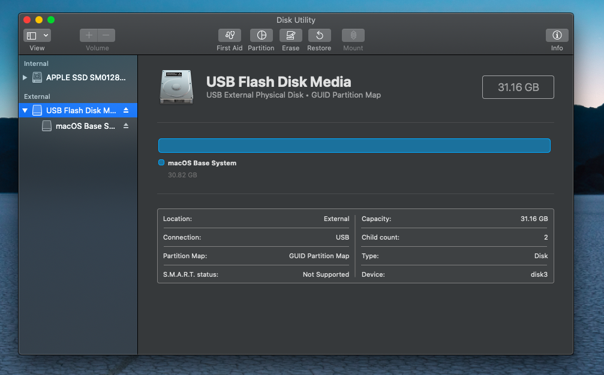
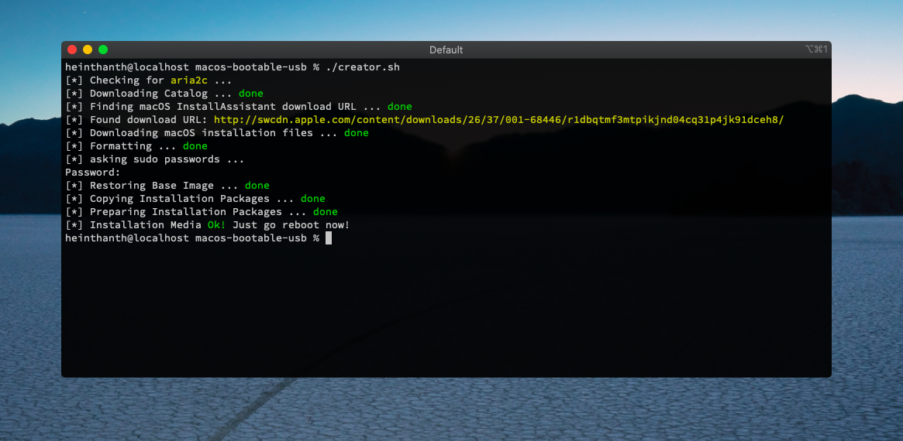

# macos-bootable-usb

[](LICENSE.md)

Modified version of [macos-guest-virtualbox.sh](https://github.com/myspaghetti/macos-virtualbox) to create macOS installation media outside Mac app store.\
Thanks me later :3

## How to Use

it's still in beta. Simply, just edit `MACOS_VERSION` and `TARGET_DISK` variables and run the script.

`TARGET_DISK` information can be found in `diskutil` > `table` > `Device`. In this example `disk3`. So, `TARGET_DISK` become `/dev/disk3`.



```shell script
$ git clone https://github.com/heinthanth/macos-bootable-usb
$ cd macos-bootable-usb
$ ./creator.sh
```



## License

This work is licensed under GPLv2. See [License](LICENSE.md) for more information.
