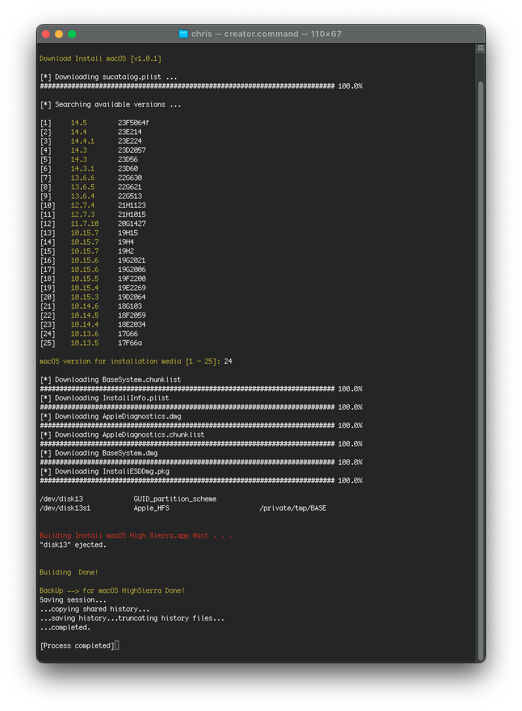
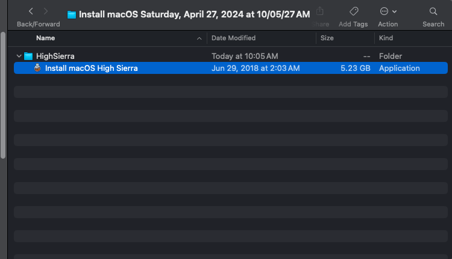

# macos-bootable-usb

[](LICENSE.md)

Combination of some codes and applications to create macOS installation media outside Mac app store.\
Thanks me later :3

## Motivation

Honestly, the main reason is I've limited Internet. I can't download the whole 8GB, 12GB at one stroke. So, I've to download multiple times and MAS doesn't support it. Moreover, I want to save downloaded installer so that I can use them next time. That's why I made this script.

## How to Use

#### Clone the repository
```bash
git clone https://github.com/htmm/macos-bootable-usb.git
cd $HOME/macos-bootable-usb
chmod +x ./creator.command
chmod +x ./Create_Install_Media.command
```

#### Downloading Install macOS from apple server
```bash

cd $HOME/macos-bootable-usb
./creator.command
```

#### Creating Create Install Media bootable drive
```bash

cd $HOME/macos-bootable-usb
./Create_Install_Media.command
```


it's still in beta. Simply just run the script, answer the question and go!





`DISK SELECTION` information can be found in `diskutil` > `table` > `Device`. In this example `disk3`. So, `TARGET_DISK` become `/dev/disk3`.


Optionally, you can verify the script with this command.

``` shell script
$ curl -LO https://github.com/heinthanth/macos-bootable-usb/releases/latest/download/SHASUM
$ shasum -c SHASUM
```

Moreover, if you don't trust `SHASUM` file, go check with `gpg`

```
$ curl -LO https://github.com/heinthanth/macos-bootable-usb/releases/latest/download/SHASUM
$ curl -LO https://github.com/heinthanth/macos-bootable-usb/releases/latest/download/SHASUM.gpg
$ gpg --keyserver hkp://keys.gnupg.net --recv-key 46D4B29338EE5105BCA79A142E1082FBF9CB91E9
$ gpg --verify SHASUM.gpg SHASUM
```
## Thanks

Thanks to -

* <https://github.com/myspaghetti/macos-virtualbox>
* <https://github.com/kholia/OSX-KVM>

## License

This work is licensed under GPLv3. See [License](LICENSE.md) for more information.
